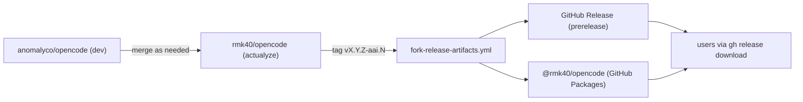
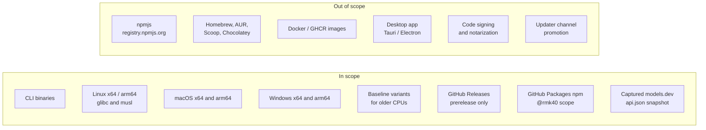
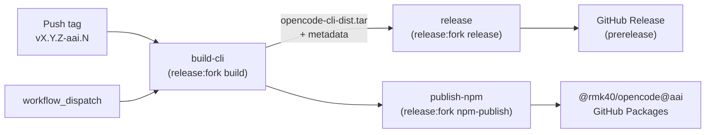

<p align="center">
  <picture>
    <source srcset="packages/console/app/src/asset/logo-ornate-dark.svg" media="(prefers-color-scheme: dark)">
    <source srcset="packages/console/app/src/asset/logo-ornate-light.svg" media="(prefers-color-scheme: light)">
    
  </picture>
</p>
<p align="center"><b>opencode — <code>rmk40/opencode</code> fork (the <code>aai</code> channel)</b></p>
<p align="center">
  <a href="https://github.com/rmk40/opencode/releases"></a>
  <a href="https://github.com/rmk40/opencode/actions/workflows/fork-release-artifacts.yml"></a>
  <a href="https://github.com/rmk40/opencode/pkgs/npm/opencode"></a>
</p>

[](https://github.com/rmk40/opencode)

## Mission

The current focus of this fork is to **dramatically improve the mobile and
web experience** of opencode. Long-running coding sessions deserve a UI
that's pleasant to drive from a phone — iOS PWA support, sane mobile
chrome, fast tab switching, calm progress indicators, mobile-first input
ergonomics. That is where the active development is going for the
foreseeable future.

The fork's intent is to **mirror upstream OpenCode**, not diverge from it:

- **The core stays compatible.** No API breaking changes. No schema
  breaking changes. Sessions, plugins, and configurations that work
  against upstream `opencode` work against this fork.
- **The fork carries patches** for bugs and key issues that haven't
  landed upstream yet, plus the mobile/web UI work that motivated the
  fork in the first place.
- **Some of this work is intended to flow back upstream.** Where a fix
  or feature is generally useful, the goal is to land it in upstream
  OpenCode rather than keep it fork-only forever. The fork exists so
  the work can ship and evolve without waiting on upstream's review
  cadence.

**Contributions welcome** under that criteria — bug fixes, mobile/web
UX improvements, and patches that maintain upstream compatibility. Open
an issue or PR against the [`actualyze`](https://github.com/rmk40/opencode/tree/actualyze)
branch.

## Quick Facts

- **Repository:** `rmk40/opencode`
- **Release branch:** `actualyze`
- **Release channel:** `aai`
- **Tag format:** `vX.Y.Z-aai.N` (e.g. `v1.14.24-aai.6`)
- **npm package:** `@rmk40/opencode`
- **npm registry:** `https://npm.pkg.github.com` (GitHub Packages)
- **GitHub releases:** [`rmk40/opencode/releases`](https://github.com/rmk40/opencode/releases) (always `--prerelease`)
- **Distribution scope:** CLI only. No Homebrew, AUR, Docker, desktop bundles, signing, or notarization.

## Install

GitHub Packages requires a GitHub personal access token with the
`read:packages` scope, even for public packages. Set up `~/.npmrc` once:

```ini
@rmk40:registry=https://npm.pkg.github.com
//npm.pkg.github.com/:_authToken=YOUR_GITHUB_TOKEN
```

Then install globally with whichever package manager you use:

```bash
# npm
npm install -g @rmk40/opencode@aai

# bun
bun install -g @rmk40/opencode@aai

# pnpm
pnpm install -g @rmk40/opencode@aai
```

One-off install without editing `~/.npmrc`:

```bash
NODE_AUTH_TOKEN=YOUR_GITHUB_TOKEN \
  npm install -g @rmk40/opencode@aai \
  --registry=https://npm.pkg.github.com
```

The `aai` dist-tag always points at the newest published fork version.

### Direct binary download (no npm)

Every release publishes per-platform archives plus `SHA256SUMS` to GitHub
Releases. Pick your platform from the
[releases page](https://github.com/rmk40/opencode/releases/latest)
or use `gh`:

```bash
gh release download --repo rmk40/opencode \
  --pattern 'opencode-*' --pattern 'SHA256SUMS' \
  --dir ./opencode-release
( cd ./opencode-release && sha256sum -c SHA256SUMS )
```

Linux archives are `.tar.gz`, macOS and Windows archives are `.zip`. The
contents are the binary plus its support files; extract somewhere on your
`PATH`.

Available targets:

| Platform      | Architectures            |
| ------------- | ------------------------ |
| macOS         | arm64, x64, x64-baseline |
| Linux (glibc) | x64, x64-baseline, arm64 |
| Linux (musl)  | x64, x64-baseline, arm64 |
| Windows       | x64, x64-baseline, arm64 |

The `-baseline` variants target older CPUs (no AVX2). The `-musl`
variants are for Alpine and other musl-libc distros.

## Upgrade

The fork build of `opencode` knows it came from this fork — the binary
has the fork repo, npm package, and registry baked in at build time, so
`opencode upgrade` queries `@rmk40/opencode@aai` on
`https://npm.pkg.github.com` instead of upstream npmjs.

```bash
opencode upgrade
```

It picks the upgrade method that matches how you installed it: `npm`,
`bun`, or `pnpm` (for global installs), or the GitHub releases fallback.
Upstream-only paths (`brew`, `scoop`, `choco`, the upstream `curl`
installer) are explicitly disabled in fork builds — they would resolve
to the upstream package and silently downgrade you off the fork channel.

If you see an auth error, your `~/.npmrc` token has expired or lacks
`read:packages`; the upgrade command will tell you what to fix.

## Web interface

Run `opencode web` to start the local server and open the browser UI.
The root route (`/`) opens the native dashboard, and the legacy home
screen remains available at `/home`.

By default, server commands bind to `127.0.0.1`. Set
`OPENCODE_SERVER_PASSWORD` before binding to non-loopback hosts such as
`0.0.0.0` or enabling mDNS. Pass `--allow-insecure-no-auth` (or set
`server.allowInsecureNoAuth` in `opencode.json`) only when you
intentionally accept unauthenticated network access.

If embedded UI assets are missing or disabled with
`OPENCODE_DISABLE_EMBEDDED_WEB_UI`, the server fails closed with a
local 503 page; it does not proxy to the upstream hosted UI.

## Verify a release

```bash
# Show the latest fork release
gh release view --repo rmk40/opencode

# Resolve the aai dist-tag against GitHub Packages
NODE_AUTH_TOKEN=YOUR_GITHUB_TOKEN \
  npm view @rmk40/opencode@aai version \
  --registry=https://npm.pkg.github.com
```

Both should report the same `X.Y.Z-aai.N` version. If they don't, a
publish failed mid-flight; see [Failure modes](#failure-modes).

## How the fork is structured

This fork tracks upstream `dev` and adds a long-lived release branch
plus a self-contained release pipeline. Nothing about the upstream
release infrastructure is reused.



- **`actualyze`** is the long-lived release branch. Merge upstream
  `dev` into it; never recreate or reset it.
- **Tags** drive releases. Push `vX.Y.Z-aai.N` from a commit reachable
  from `actualyze` and CI does the rest.
- **`workflow_dispatch`** is a manual fallback for testing CI without
  cutting a real release. Manual runs always produce drafts; tag pushes
  always produce published prereleases.

`X.Y.Z` is the upstream version this build is based on. `aai.N` is the
fork's monotonic suffix — once `aai.N` is published, it is never reused.

### What ships and what does not



If you need anything in the right column, that is a separate change.
Do not bolt it onto the fork pipeline ad-hoc.

## The release pipeline

The pipeline is implemented by three files:

- `.github/workflows/fork-release-artifacts.yml` — the workflow.
- `script/fork-release-artifacts.sh` — all the actual logic.
- The root `package.json` script `release:fork` — the canonical entrypoint.

Always invoke the helper through the package script. Direct calls to
`script/fork-release-artifacts.sh` or `packages/opencode/script/build.ts`
are unsupported.

```bash
bun run release:fork -- <subcommand> [...args]
```

Subcommands:

| Subcommand    | What it does                                                               |
| ------------- | -------------------------------------------------------------------------- |
| `validate`    | Validates context, derives `version`/`channel`, writes job outputs.        |
| `build`       | Runs the upstream CLI build, captures models.dev, validates artifacts.     |
| `package`     | Stages release archives (`.tar.gz` / `.zip`) and writes `SHA256SUMS`.      |
| `release`     | Creates the GitHub release and uploads assets (binaries first, sums last). |
| `npm-package` | Stages wrapper + per-target `@rmk40/*` packages and tarballs locally.      |
| `npm-publish` | Preflights, publishes, verifies; `--ignore-scripts --tag aai`.             |
| `self-test`   | Offline regression suite. Touches no network, no registry.                 |

### Job graph



- `build-cli` runs the upstream `packages/opencode/script/build.ts`,
  smoke-tests the runner-native binaries, runs Alpine musl smoke tests
  inside `alpine:3.20` (after installing `libstdc++` and `libgcc`), and
  hands off `opencode-cli-dist.tar` to the downstream jobs. The dist
  tar preserves executable bits across the `actions/upload-artifact`
  boundary, which raw directory uploads do not.
- `release` requires `contents: write`, runs only on a tag push or
  when `inputs.create_release == true`, and publishes the release as
  prerelease. Tag pushes target the triggering tag; manual runs pass
  `--draft --target $GITHUB_SHA`.
- `publish-npm` requires `packages: write`, runs only on a tag push or
  when `inputs.publish_npm == true`, and depends on both `build-cli`
  and `release` so a failed release cannot leave npm published without
  a corresponding GitHub release.

The whole workflow runs on Node.js 24
(`FORCE_JAVASCRIPT_ACTIONS_TO_NODE24: "true"` plus explicit
`actions/setup-node@v4 { node-version: "24" }`).

### Cutting a release

```bash
git checkout actualyze
# ...do work, merge upstream as needed...
git push fork actualyze

git tag v1.14.24-aai.5
git push fork v1.14.24-aai.5
```

CI then:

1. Builds and smoke-tests every target.
2. Publishes the GitHub release as a prerelease.
3. Publishes `@rmk40/opencode@1.14.24-aai.5` and per-target packages
   to GitHub Packages, applying dist-tag `aai`.

Verify after CI is green:

```bash
gh release view v1.14.24-aai.5 --repo rmk40/opencode \
  --json tagName,isDraft,isPrerelease,assets

NODE_AUTH_TOKEN=YOUR_GITHUB_TOKEN \
  npm view @rmk40/opencode@aai version \
  --registry=https://npm.pkg.github.com
```

Manual fallback (only when needed, e.g. retesting CI behavior without
cutting a real release):

```bash
gh workflow run fork-release-artifacts.yml \
  --repo rmk40/opencode \
  --ref actualyze \
  -f upstream_version=1.14.24 \
  -f suffix=aai.5 \
  -f create_release=true \
  -f publish_npm=true
```

### Local validation

```bash
bash -n script/fork-release-artifacts.sh
bun run release:fork -- self-test
ruby -e 'require "yaml"; YAML.load_file(".github/workflows/fork-release-artifacts.yml"); puts "ok"'
bun -e "JSON.parse(await Bun.file('package.json').text()); console.log('ok')"
git diff --check
```

For local debugging of `package` / `release` / `npm-publish` without
running CI:

```bash
export FORK_RELEASE_SKIP_CONTEXT_CHECK=1
export FORK_RELEASE_ALLOW_LOCAL_DIST=1
```

These overrides are intended for local debugging and must not appear
in CI runs.

## Build identity

The fork build bakes three install-identity values into the binary at
build time so `opencode upgrade` always queries the fork:

```text
OPENCODE_REPO=rmk40/opencode
OPENCODE_NPM_PACKAGE=@rmk40/opencode
OPENCODE_NPM_REGISTRY=https://npm.pkg.github.com
```

`script/fork-release-artifacts.sh build` exports these and aborts if
any is empty. They flow into the binary via
`packages/opencode/src/installation/version.ts` and are consumed by
`packages/opencode/src/installation/index.ts`. The release channel is
always `OPENCODE_CHANNEL=aai`.

The build also unsets `OPENCODE_BUMP`, `OPENCODE_RELEASE`, and `GH_REPO`
before invoking `build.ts` to prevent upstream version-bump or publish
side effects from leaking into a fork build.

## npm package layout

| Package                          | Role                                                       |
| -------------------------------- | ---------------------------------------------------------- |
| `@rmk40/opencode`                | Wrapper. Resolves the right per-target package at install. |
| `@rmk40/opencode-darwin-arm64`   | Per-target binary.                                         |
| `@rmk40/opencode-darwin-x64`     | Per-target binary.                                         |
| `@rmk40/opencode-linux-x64`      | Per-target binary.                                         |
| `@rmk40/opencode-linux-arm64`    | Per-target binary.                                         |
| `@rmk40/opencode-linux-x64-musl` | Per-target binary (Alpine).                                |
| `@rmk40/opencode-windows-x64`    | Per-target binary.                                         |
| ...                              | One per target listed under [Install](#install).           |

Wrapper metadata:

- `bin: { opencode: "./bin/opencode" }`
- `scripts.postinstall: "node ./postinstall.mjs"`
- `optionalDependencies` is set to every scoped per-target package at
  the same version. The wrapper bin and `postinstall.mjs` resolve the
  right one dynamically by reading `optionalDependencies` rather than
  hardcoding the `@rmk40` scope.
- `publishConfig.registry: https://npm.pkg.github.com`
- `repository.url: git+https://github.com/rmk40/opencode.git`

`npm-publish` always:

1. Stages packages from the dist tar (never the working tree).
2. Verifies the requested version matches the metadata.
3. Preflights every `@rmk40/*@<version>` against
   `https://npm.pkg.github.com`. If any version already exists, fails
   before publishing anything.
4. Publishes per-target packages first, then `@rmk40/opencode`, all
   with `--ignore-scripts --tag aai`.
5. Verifies post-publish that `@rmk40/opencode@aai` resolves to the
   new version.

## Failure modes

The pipeline is designed to fail closed.

| Failure                                            | Recovery                                                                 |
| -------------------------------------------------- | ------------------------------------------------------------------------ |
| `validate` rejects the tag                         | Delete the tag, fix the input (`X.Y.Z-aai.N`, no leading zeros), re-tag. |
| Tag commit not reachable from `actualyze`          | Merge or rebase onto `actualyze`, re-tag from the new commit.            |
| `build-cli` fails                                  | Nothing was uploaded. Fix the build, push, retag.                        |
| `release` fails before publishing (manual draft)   | `gh release delete ... --cleanup-tag`, then rerun.                       |
| `release` fails after publishing                   | Don't retry the same version. Bump suffix, retag.                        |
| `publish-npm` fails after some packages are pushed | Don't retry the same version (immutable). Bump suffix, retag.            |

Never use the GitHub UI's "Re-run failed jobs" button on a partial
publish — always start a fresh tag.

## Running from source

For day-to-day hacking on this repo you don't want to install a
release; you want to run the CLI straight out of the working tree.
The upstream tooling for that already works on the fork — the fork
only changes release identity, not the dev loop.

### One-time setup

```bash
bun install
```

Bun 1.3+ is required (`packageManager` pins `bun@1.3.13`). The root
`postinstall` runs `packages/opencode/script/fix-node-pty.ts` to wire
up `node-pty` for your platform; using `npm`/`pnpm` will silently break
workspace links and patches.

### `bun dev` — the primary loop

```bash
bun dev                  # TUI in packages/opencode (the default cwd)
bun dev .                # TUI in the repo root
bun dev /some/project    # TUI against another directory
bun dev --help           # full CLI surface, same as the built binary
bun dev serve            # headless API server on :4096
bun dev serve --port 8080
bun dev web              # server + open web UI
```

`bun dev` is just `bun run --cwd packages/opencode --conditions=browser src/index.ts`.
Edits to TypeScript source are picked up on the next run with no
separate build step. The `--conditions=browser` flag is required so
the conditional `imports` in `packages/opencode/package.json` (`#db`,
`#pty`, `#hono`) resolve to the right adapters.

### Adjacent dev servers

| Goal                   | Command                                              |
| ---------------------- | ---------------------------------------------------- |
| Web UI dev server      | `bun run --cwd packages/app dev` (server must be up) |
| Desktop (Tauri) shell  | `bun run --cwd packages/desktop tauri dev`           |
| Console app dev server | `bun dev:console`                                    |
| Storybook              | `bun dev:storybook`                                  |

### "localcode" — a standalone binary from source

When you need to test the actual compiled artifact (`Bun.build`
output) — verifying `script/build.ts` changes, validating the binary
that the release pipeline would ship, or just running outside Bun's
runner — build a single-target executable:

```bash
./packages/opencode/script/build.ts --single
./packages/opencode/dist/opencode-<platform>-<arch>/bin/opencode --help
```

This is **not** the fork-pipeline build. It does not bake the fork
identity defines (`OPENCODE_REPO`, `OPENCODE_NPM_PACKAGE`,
`OPENCODE_NPM_REGISTRY`), so `opencode upgrade` from this binary
behaves like an upstream build — which for local dev is fine, you
don't want it auto-upgrading anyway.

### Fork-style local build

If you specifically need to test fork upgrade behavior locally
(`opencode upgrade` querying `@rmk40/opencode@aai`), invoke the
release helper in local-debug mode:

```bash
export FORK_RELEASE_SKIP_CONTEXT_CHECK=1
bun run release:fork -- build \
  --upstream-version 1.14.24 \
  --suffix aai.0 \
  --version 1.14.24-aai.0
```

`aai.0` is intentionally invalid for publishing (the publish regex
requires `[1-9][0-9]*`), so it's a safe sentinel meaning "local
debug build, never going to ship". Real `aai.N` suffixes belong to
CI tags.

### Debugging

```bash
# Server with debugger attached, separate process
bun run --inspect=ws://localhost:6499/ --cwd packages/opencode \
  ./src/index.ts serve --port 4096

# Attach the TUI client in another terminal
opencode attach http://localhost:4096

# Or run the TUI under the debugger directly
bun run --inspect=ws://localhost:6499/ --cwd packages/opencode \
  --conditions=browser ./src/index.ts
```

`bun dev` runs the server in a worker thread, which can prevent
breakpoints from binding. Use `bun dev spawn` to force a separate
process, or run server and TUI separately as shown above.

### Pitfalls

- Skipping `bun install` — the `postinstall` step is required.
- Using `npm`/`pnpm` instead of `bun` — breaks workspace and patches.
- Calling `bun run packages/opencode/src/index.ts` without
  `--conditions=browser` — fails to resolve `#pty` / `#hono` / `#db`.
- A stale `packages/opencode/dist/` shadowing changes if you invoke
  the dist binary instead of `bun dev`. Run `rm -rf packages/opencode/dist`
  if in doubt.
- Setting `OPENCODE_REPO` / `OPENCODE_NPM_PACKAGE` /
  `OPENCODE_NPM_REGISTRY` for local dev — those are only consumed
  by the fork release build. They do nothing for `bun dev`.

See [`CONTRIBUTING.md`](CONTRIBUTING.md) for the upstream-flavored
contributor docs (provider additions, PR rules, deeper debugger setup).

## Reference

- [`docs/fork-release-pipeline.md`](docs/fork-release-pipeline.md) —
  detailed operator/agent reference for every subcommand and job.
- [`release-artifact-pipeline-plan.md`](release-artifact-pipeline-plan.md) —
  long-form design rationale.
- [`AGENTS.md`](AGENTS.md) — short operating notes for agents working
  in this repo.

## Contributing to the fork

The fork tracks upstream and adds release plumbing only. Contributions
that belong upstream should go upstream; the fork merges them in via
`actualyze`. Contributions that are fork-specific (release pipeline,
fork build identity, fork operational docs) belong on `actualyze`.

Standards:

- Every change to the release pipeline must keep
  `bun run release:fork -- self-test` green.
- Every public API or CLI behavior change should update
  `docs/fork-release-pipeline.md` in the same change-set.
- Don't reuse a published `aai.N` suffix. Ever.

---

**Upstream project:** [`anomalyco/opencode`](https://github.com/anomalyco/opencode).
The fork exists to ship CLI-only release artifacts on a separate
channel; it is not a hostile fork and tracks upstream `dev` continuously.
